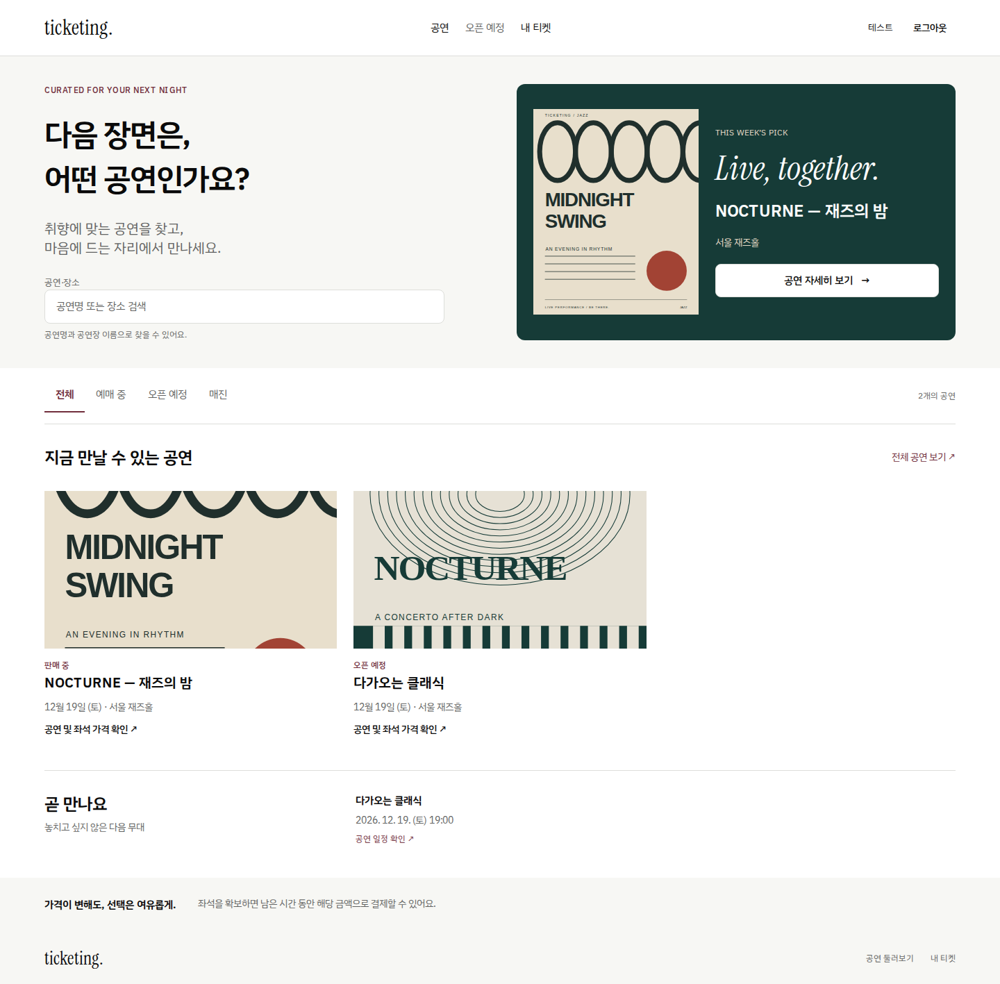
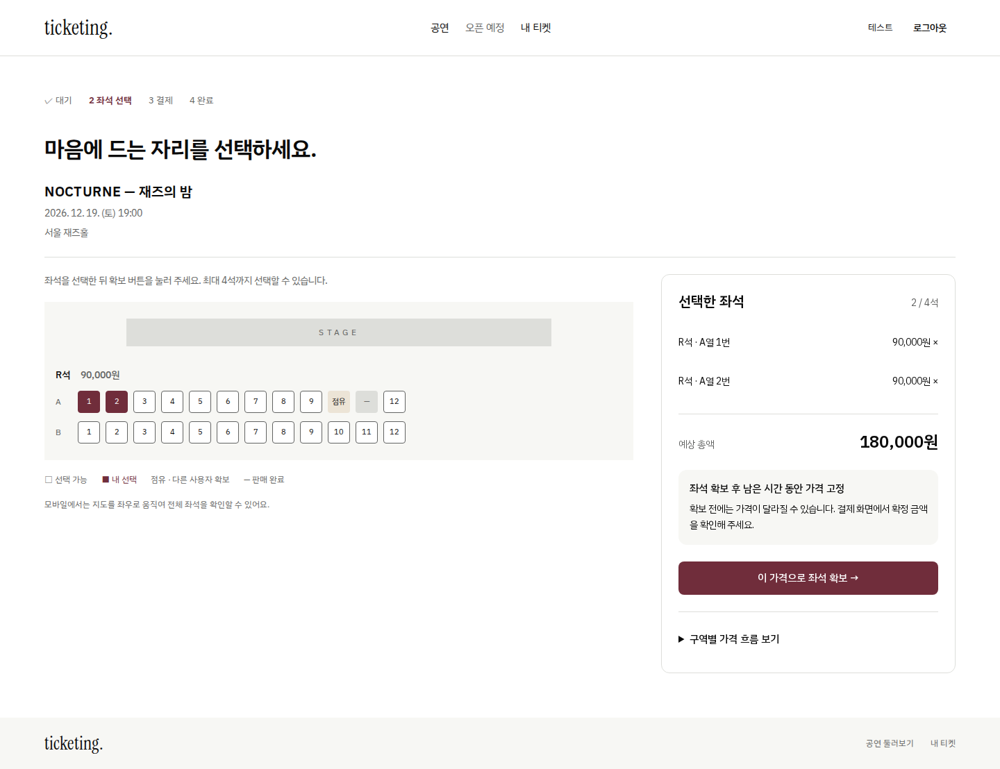
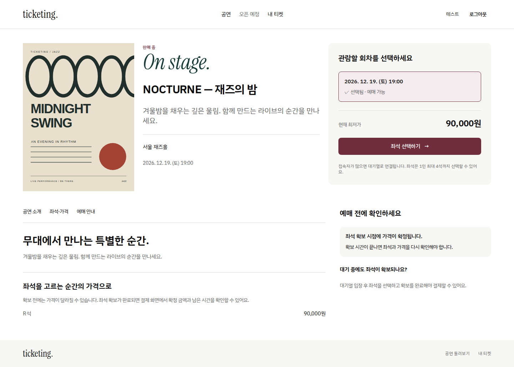
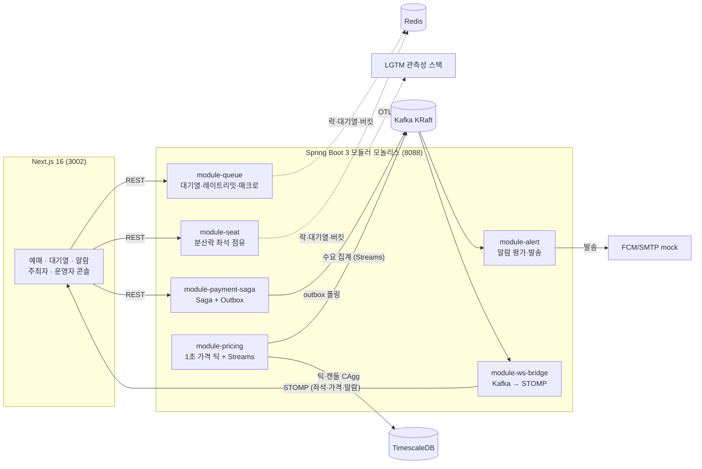

# Ticketing — 다이나믹 프라이싱 예매 플랫폼

수요에 따라 가격이 변하는 공연 예매를 구현한 포트폴리오 프로젝트입니다. **좌석 확보 시점의 가격을 결제까지 고정**하고, 좌석 경합·연결 끊김·결제 결과 지연에서도 사용자가 예매를 이어갈 수 있도록 설계했습니다.

Java 17 · Spring Boot 3 · Next.js 16 · TypeScript · Redis · Kafka · TimescaleDB

| 공연 탐색 | 좌석 선택과 가격 | 공연 상세 |
| --- | --- | --- |
|  |  |  |

화면은 브라우저 자동 테스트의 가상 공연·계정 데이터로 촬영했습니다. 실제 고객 정보나 결제 정보는 포함하지 않습니다.

## 핵심 구현

| 해결할 문제 | 구현과 확인 지점 |
| --- | --- |
| 같은 좌석에 요청이 몰리는 상황 | Redisson 분산락, 좌석 ID 순서로 다중 락 획득, JPA 낙관적 락 |
| 확보 후 가격이 바뀌는 상황 | 좌석 점유에 구역별 단가·총액 스냅샷 저장, 결제 금액 고정 |
| 결제 재시도와 비동기 승인 | Saga + Outbox + 멱등 키, 결과 조회 실패 시 중복 청구 없이 조회 재개 |
| 실시간 연결 유실 | STOMP 재연결 시 재조회, 주기적 스냅샷, 늦게 도착한 스냅샷과 이벤트 정합성 |
| 예매 중 오류와 모바일 조작 | 선택 유지, 만료·대기 제한 안내, 모바일 하단 액션, 키보드 좌석 선택 |
| 디자인 일관성 | CSS 토큰, 공통 컨트롤, 예매 상태별 안내·복구 패턴 |

## 실행

Docker Compose, JDK 17, Node.js 22, pnpm 9.15.9가 필요합니다. 최초 빌드에는 의존성 다운로드 시간이 걸립니다.

터미널 1 — 인프라와 백엔드:

```bash
make up
make backend
```

터미널 2 — 프론트엔드:

```bash
cd frontend
pnpm install --frozen-lockfile
pnpm dev
```

앱: http://localhost:3002 · API: http://localhost:8088 · Grafana: http://localhost:3031

공연은 로컬 시드로 생성됩니다. 일반 관객은 회원가입 후 예매하며, 로컬 콘솔 데모 계정은 `organizer@demo.ticketing.local`, `admin@demo.ticketing.local`입니다(비밀번호 `Demo1234!`). DB·Grafana·데모 계정의 기본 자격 증명은 로컬 시연용입니다. 외부 운영 환경에는 그대로 사용하지 않습니다. 결제는 Mock PG이며 실제 금전 거래를 하지 않습니다.

## 검증

```bash
# 프론트엔드: API 모의 응답 기반, 백엔드 실행 불필요
cd frontend
pnpm exec playwright install chromium webkit
pnpm lint
pnpm build
pnpm typecheck
pnpm test:e2e

# 백엔드: 저장소 루트에서, Docker 필요
make test
```

브라우저 자동 검증은 데스크톱 Chromium·모바일 Chromium·모바일 WebKit의 31개 시나리오씩 총 93개입니다. GitHub Actions에서도 lint → build → typecheck → 브라우저 테스트를 실행합니다. 실제 iPhone Safari 및 실제 참여자 사용성 테스트는 아직 수행하지 않았습니다.

### 성능 측정의 범위

아래 수치는 **2026년 7월 로컬 단일 노드·Mock PG 환경의 기록**이며, 이번 공개 준비에서 부하 테스트를 다시 수행한 결과는 아닙니다. [환경·원본 결과·제약](docs/loadtest/2026-07-28-kpi-report.md)을 함께 확인해 주세요.

| 시나리오 | 관찰 결과 | 해석 범위 |
| --- | --- | --- |
| Gatling 1,000 VU / 60초 | 좌석 조회 p95 13ms, 결제 API p95 21ms, 중복 점유·결제 0건 | 토큰 사전 발급, Mock PG, 로컬 환경 |
| Locust 100 VU / 3분 | 시뮬레이션 봇 차단 100%, 정상 요청 오탐 0건 | 정의된 봇 패턴과 테스트 IP 조건에 한정 |
| FullPeak 총 4,100 VU 주입 | 혼합 조회·예매·대기 시나리오 실행 | 누적 가상 사용자 수이며 4,100 동시 접속을 의미하지 않음 |

10만 동시 접속, WebSocket 5만 연결, 활성 알람 100k는 설계 목표입니다. 해당 규모의 검증을 완료했다고 주장하지 않습니다.

## 구조



| 경로 | 내용 |
| --- | --- |
| `backend/` | 인증·공연·대기열·좌석·결제·가격·알람·WebSocket 모듈 |
| `frontend/` | App Router, 디자인 토큰·공통 UI, 예매 UX, E2E |
| `infra/` | Compose, k3d, Grafana 대시보드와 관측성 설정 |
| `loadtest/` | Gatling 부하 시나리오와 Locust 봇 시뮬레이션 |
| `docs/` | 아키텍처, 기술 결정 기록, 측정 결과 |

## 더 읽기

- [아키텍처와 코드 탐색 가이드](docs/ARCHITECTURE.md)
- [프론트엔드 디자인 시스템·상태 설계·테스트 가이드](frontend/README.md)
- [Saga 선택](docs/adr/0001-saga-vs-2pc.md) · [Outbox 방식](docs/adr/0002-outbox-polling-vs-debezium.md)
- [Mock 서비스와 k3d 범위](docs/adr/0004-mock-fcm-smtp-and-k3d-scope.md)
- [공개 범위와 보안 점검 기록](SECURITY.md)

이 저장소는 포트폴리오 검토와 로컬 시연을 위한 코드입니다. 별도의 오픈소스 라이선스는 아직 지정하지 않았습니다.
